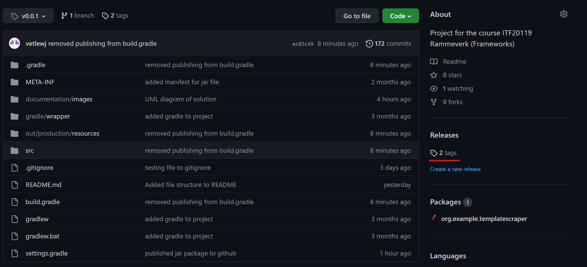
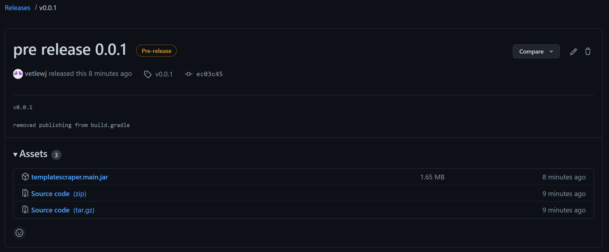

# Getting started
The framework is divided into two layers; Scraper, a regular web scraper, and TemplateScraper, a set of classes and functions to create your own custom templates for scraping websites. 

## JavaDoc
JavaDoc for the framework is available [**here**](https://vetlewj.github.io/TemplateScraper/index.html)

## Setup
The framework can be downloaded from [GitHub](https://github.com/vetlewj/Rammeverk-FinalProject). There are various ways 
to install the framework through Github, but the preferred method is to download from the assets under the newest tags. 

### Installing the framework

To use the project, you can either install the source code as a ZIP file, or install the jar file which only contains 
the compiled framework. 

To install the framework, click on the tags under releases: 



This will direct you to a list of tags for various releases. Click on the latest version, and it will direct you to a 
page with the download links under assets: 



Choose either the ZIP file or the JAR file, and install it. If you wish to use the framework in another Java project, 
it is recommended to download the JAR file. The setup in IntelliJ is described in the IntelliJ setup guide will show how
to setup and use the framework with the JAR file. 

### Setup in IntelliJ with JAR file

After downloading the JAR file, create a new or use an existing project in IntelliJ. In the top menu bar, press File &rarr; 
Project Structure or press `CTRL + Alt + Shift + S`. 


This will open a Project Structure menu. Select library from the menu on the side and then press `+` and select Java.


This will open up a window prompting you to select Library files. Locate and select the jar file, and press OK. 


After selecting the correct JAR file, press Apply in the Project Structure menu. You can now use the library just like 
any other library and it will be visible under External Libraries. IntelliSense in IntelliJ should also be able to suggest the classes from the library.


## Scraper
Scraper is meant to be used as most other web scrapers available, and it requires some familiarity with HTML, XML or 
other similar languages. 

Scraper can be used to scrape HTML documents and get requested data.

### Examples

#### Set up a webscraper for https://snl.no/Michelangelo and retrieve all h1 elements.

```java
Scraper scraper1 = Scraper.buildScraperWithURL("https://snl.no/Michelangelo");
scraper1.getElementsFromTag("h1");
```

#### Set up a webscraper for an html called “Michelangelo.html” located in the root folder of the project, and retrieve alle p elements in the file to an arraylist
```java
File fileToScrape = new File("../Michelangelo.html");
Scraper scraper2 = Scraper.buildScraperWithHtmlFile(fileToScrape);
ArrayList<HtmlElement> paragraphs;

paragraphs = scraper2.getElementsFromTag("p");
```

## TemplateScraper
TemplateScraper is another layer of abstraction that is meant to make it easy to create Templates for scraping websites.

To create your own implementation you can either inherit directly from TemplateScraper, or from one of the abstract 
subclasses. Currently there are two abstract subclasses to extend from: ArticleTemplate and ProductTemplate. These are 
meant to scrape articles and products respectively. 

I have also created a concrete implementation of ArticleTemplate called SnlArticleTemplate which is meant to scrape 
articles from the [snl.no](https://snl.no). 

As of 04.03.22 there are two templates you can use when creating your own custom templates; ArticleTemplate and 
ProductTemplate. When you create your own templates to scrape articles or products, you can inherit from these classes 
and override the methods where you need a custom implementation. 

### Examples

#### A template made for scraping articles from [snl.no](https://snl.no). 

In the snippet below I have only included some of the methods, but the full code with JavaDoc comments is available 
in the github repository: [SnlArticleTemplate.java](https://github.com/vetlewj/TemplateScraper/blob/main/src/main/java/scraper/templatescraper/templates/SnlArticleTemplate.java).

```java
public class SnlArticleTemplate extends ArticleTemplate {
    private Scraper scraper;
    
    public SnlArticleTemplate(String url) {
        super();
        setSourceAsUrl(url);
        try {
            scraper = getScraper();
        } catch (ScraperNotInitializedException e) {
            e.printStackTrace();
        }
    }

    @Override
    public String getIntroduction() {
        return scraper.getElementsByTag("p").get(0).getText();
    }

    @Override
    public HashMap<String, String> getTextContentWithHeaders() {
        HashMap<String, String> textContent = new HashMap<>();
        ArrayList<HtmlElement> articleSections = scraper.getElementsByClass("l-article__section");
        for (HtmlElement articleSection : articleSections) {
            if (articleSection.getElementsByClass("l-article__subheading").size() > 0) {
                textContent.put(articleSection.getElementsByClass("l-article__subheading").get(0).getText(),
                        articleSection.getElementsByClass("l-article__body-text").get(0).getText());
            } else {
                textContent.put("No heading", articleSection.getElementsByClass("l-article__body-text").get(0).getText());
            }
        }
        return textContent;
    }
    
    @Override
    public ArrayList<String> getWriters() {
        ArrayList<String> writers = new ArrayList<>();
        ArrayList<HtmlElement> elements = scraper.getElementsByClass("article-info__author");
        for (HtmlElement element : elements) {
            writers.add(element.getText());
        }
        return writers;
    }
    
    @Override
    public LocalDateTime getDateTimePublished() {
        try {
            String datetime = scraper.getElementsByXpath("//dd[@class='article-info__item-value']/time").get(0).getAttributeValue("datetime");
            ZonedDateTime zonedDateTime = ZonedDateTime.parse(datetime);
            return zonedDateTime.toLocalDateTime();
        } catch (InvalidXPathException e) {
            e.printStackTrace();
        }
        return null;
    }

}

```


## XPath
XPath stands for XML Path Language [(MDN web docs, 2022)](https://developer.mozilla.org/en-US/docs/Web/XPath). It is 
used as a way to select elements in an XML document. XML and HTML are similar and XPath can also be used to select 
elements in HTML. XPath works, as the name may suggest, by finding elements through a path. 

TemplateScraper currently have support for this XPath syntax: 
```
// : Ancestor
/ : Parent
[@key=value] : Attribute
```

Given the following HTML document:

```html
<html lang="en">
<body>
<main>
    <h1>My Heading1</h1>
    <div id="my-div">
        <span>Aleksandr Alekhin</span>
        <p>My Paragraph</p>
    </div>
    <p>My paragraph.</p>
</main>
<aside>
    <h2>My Heading</h2>
    <ul>
        <li id="Carlsen" class="chessplayer">Magnus Carlsen</li>
        <li class="chessplayer">Hikaru Nakamura</li>
        <li class="chessplayer">Mikhail Tal</li>
        <li class="chessplayer">Mikhail Botvinnik</li>        
    </ul>
</aside>
</body>
</html>
```

1. To retrieve Magnus Carlsen from the document, we can use the following XPath: `//ul/li[@id="Carlsen"]`.

2. To retrieve all elements with the class "chessplayer", we can use the following XPath: `//ul/li[@class="chessplayer"]`.

3. To get the text inside the span element, the Xpath to this element is: `//div[@id="my-div"]/span`.

To use these XPath in a scraper, you can use the getElementFromXpath method: 

```java 
// Create a scraper
Scraper scraper = Scraper.buildScraperWithFile(File fileToScrape);

// 1 get element with id "Carlsen"
HtmlElement element = scraper.getElementFromXpath("//ul/li[@id='Carlsen']");

// 2 get all elements with the class "chessplayer"
ArrayList<HtmlElement> elements = scraper.getElementsFromXpath("//ul/li[@class='chessplayer']");

// 3 get the text inside the span element
String textInsideSpan = scraper.getElementFromXpath("//div[@id='my-div']/span").getText();

```

## File Structure of the framework
```
├── scraper/
| ├── exceptions/
| | ├── ElementNotFoundException.java
| | ├── InvalidSourceException.java
| | ├── InvalidXPathException.java
| | └── ScraperNotInitializedException.java
| ├── html/
| | ├── HtmlElement.java
| | └── HtmlDocument.java
| ├── xpathparser/
| | └── XPathParser.java
│ ├── templatescraper/
| | ├── templates/
| | | └── SnlArticleTemplate.java
| | ├── ArticleTemplate.java
| | ├── ProductTemplate.java
| | └── TemplateScraper.java
| Scraper.java
```
