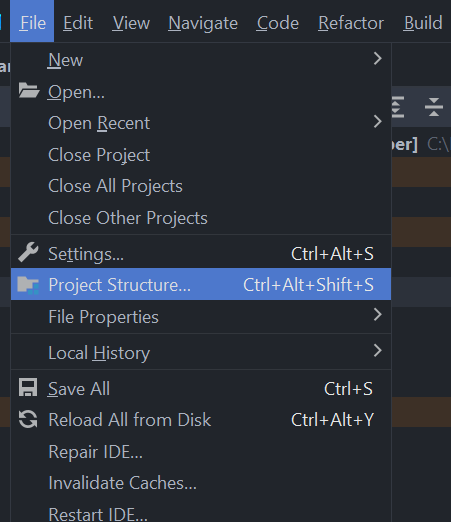
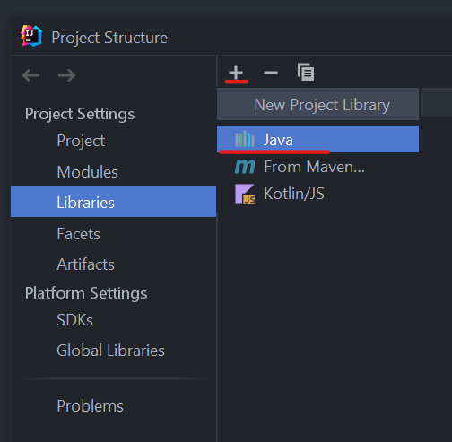
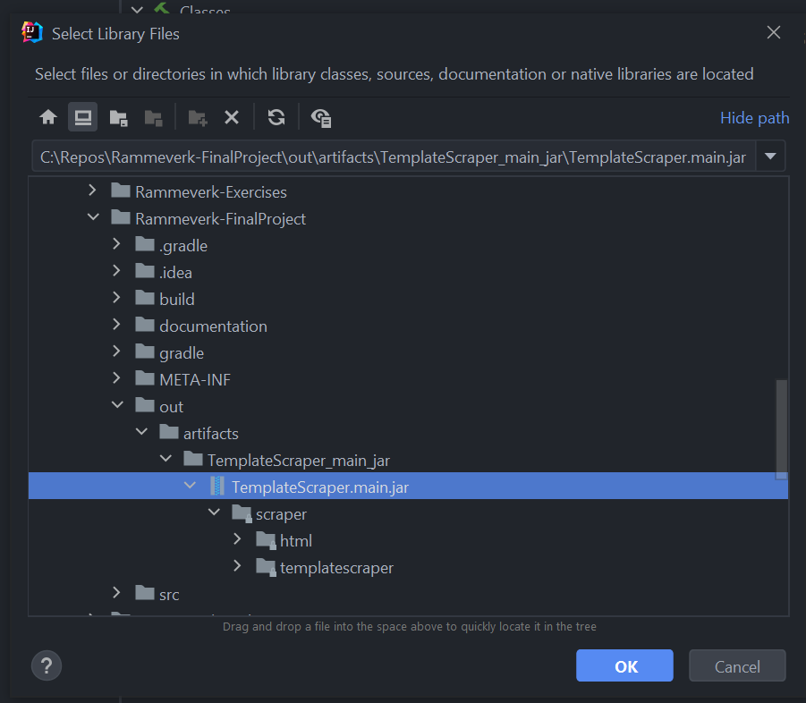
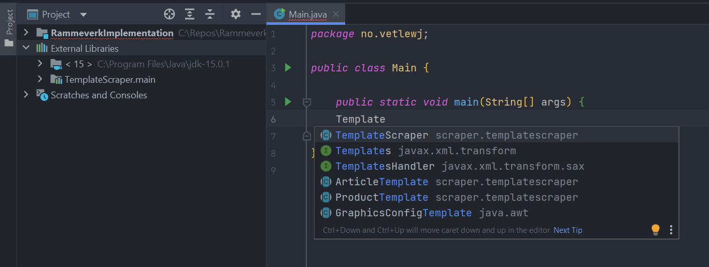

# Getting started
The framework is divided into two layers; Scraper, a regular web scraper, and TemplateScraper, a set of classes and functions to create your own custom templates for scraping websites. 

## Setup
The framework can be downloaded from [GitHub](https://github.com/vetlewj/Rammeverk-FinalProject). Click on the green
button that says Code and you will get the option to clone the project in various ways. If you are not familiar with 
git, the easiest solution is to Download as ZIP. After downloading the ZIP, the next is to unpack the project in a 
designated location. Then you can open the folder with Visual Studio Code, IntelliJ or another editor.

### Setup in IntelliJ with JAR file

After downloading the JAR file, create a new or use an existing project in IntelliJ. In the top menu bar, press File &rarr; 
Project Structure or press `CTRL + Alt + Shift + S`. 



This will open a Project Structure menu. Select library from the menu on the side and then press `+` and select Java.



This will open up a window prompting you to select Library files. Locate and select the jar file, and press OK. 



After selecting the correct JAR file, press Apply in the Project Structure menu. You can now use the library just like 
any other library and it will be visible under External Libraries. IntelliSense in IntelliJ should also be able to suggest the classes from the library.



## Scraper
Scraper is meant to be used as most other web scrapers available, and it requires some familiarity with HTML, XML or 
other similar languages. 

Scraper can be used to scrape HTML documents and get requested data.

### Examples

#### Set up a webscraper for https://snl.no/Michelangelo and retrieve all h1 elements.

```java
Scraper scraper1 = Scraper.buildScraperWithURL("https://snl.no/Michelangelo");
scraper1.getElementsFromTag("h1");
```

#### Set up a webscraper for an html called “Michelangelo.html” located in the root folder of the project, and retrieve alle p elements in the file to an arraylist
```java
File fileToScrape = new File("../Michelangelo.html");
Scraper scraper2 = Scraper.buildScraperWithHtmlFile(fileToScrape);
ArrayList<HtmlElement> paragraphs;

paragraphs = scraper2.getElementsFromTag("p");
```

## TemplateScraper
TemplateScraper is another layer of abstraction that is meant to make it easy to create Templates for scraping websites.

As of 04.03.22 there are two templates you can use when creating your own custom templates; ArticleTemplate and 
ProductTemplate. When you create your own templates to scrape articles or products, you can inherit from these classes 
and override the methods where you need a custom implementation. 

### Examples

#### Create a template for a webscraper made to scrape the name and price from products on power.no

```java
class PowerProductTemplate extends ProductTemplate {

    private String name;
    private float price;

    public String getName() {
        this.name = getScraper().getElementsByXpath("//div[@class=\"h2 bold my-spacer-none\"][1]").toString();
        return this.name;
    }

    public float getPrice() {
        this.price = Float.parseFloat(getScraper().getElementsFromTag("pwr-price").toString());
        return this.price;
    }
}
```


## XPath
XPath stands for XML Path Language [(MDN web docs, 2022)](https://developer.mozilla.org/en-US/docs/Web/XPath). It is used as a way to select elements in an XML document. XML and HTML are similar 
and XPath can also be used to select elements in HTML. XPath works, as the name may suggest, by finding elements through
a path. 

Given the following HTML document:

```html
<html lang="en">
<body>
<main>
    <h1>My Heading1</h1>
    <div id="my-div">
        <span>Aleksandr Alekhin</span>
        <p>My Paragraph</p>
    </div>
    <p>My paragraph.</p>
</main>
<aside>
    <h2>My Heading</h2>
    <ul>
        <li>Magnus Carlsen</li>
        <li>Hikaru Nakamura</li>
        <li>Mikhail Tal</li>
        <li>Mikhail Botvinnik</li>        
    </ul>
</aside>
</body>
</html>
```

Suppose you want to get the third item in the list. The Xpath to this item is: `//ul/li[3]`. 

To get the text inside the span element, the Xpath to this element is: `//div[@id="my-div"]/span`.

To use these XPath in a scraper, you can use the getElementFromXpath method: 

```java 
// Create a scraper
Scraper scraper = Scraper.buildScraperWithFile(pathToFile);

// get the HtmlElement object for the third item in the list
HtmlElement thirdElementInList = scraper.getElementFromXpath("//ul/li[3]");

// get the text inside the span element
String textInsideSpan = scraper.getElementFromXpath("//div[@id='my-div']/span").toString();
```

